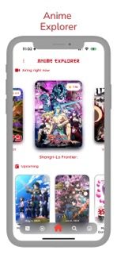
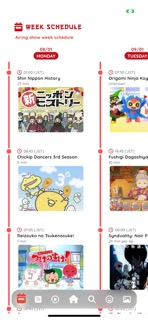

# Anime Explorer

Anime Explorer is a comprehensive mobile app that serves as a gateway to the boundless realm of anime enchantment. Immerse yourself in a curated universe of captivating stories, iconic characters, and breathtaking animation.

## Features

- **Track your favorite anime**: Keep a record of the anime shows you love and never miss an update.
- **Share news and information**: Share the latest anime news, facts, and information with your friends and fellow anime enthusiasts.
- **Quick Actions from Homescreen**: Quickly access your favorite anime features right from your device's home screen.
- **Listen to the latest news**: Stay up-to-date with the latest anime news by listening to audio updates.
- **Week show schedule view**: Never miss a new episode with the convenient weekly show schedule.
- **Wallpaper gallery**: Download and set stunning anime wallpapers for your device.
- **Latest news and currently airing shows**: Stay informed about the latest news and currently airing anime shows.
- **Upcoming shows**: Get a sneak peek at upcoming anime releases and mark your calendar.
- **Fun facts**: Discover interesting facts related to manga, anime, and more.
- **Comprehensive show information**: Access detailed information about your favorite shows, including story, characters, ratings, news, themes, genres, and more.
- **Watch trailers and episodes**: Watch show trailers and view episode information, including chapter synopses and counts.
- **Text-to-Speech accessibility**: Enjoy an accessible experience with text-to-speech functionality.
- **Casting and character information**: Learn more about the voice actors and characters behind your favorite anime.
- **Show reviews**: Read reviews from fellow fans and share your own thoughts.
- **Search by categories**: Easily find shows based on specific categories.
- **Show recommendations**: Discover new anime based on personalized recommendations.

## Developer

Anime Explorer is created and developed by Luis Ventura (luis.ventura005@gmail.com).

Immerse yourself in the enchanting world of anime with Anime Explorer, and discover hidden gems, information, recommendations, and reviews at your fingertips.

-------------------------------------------------------
